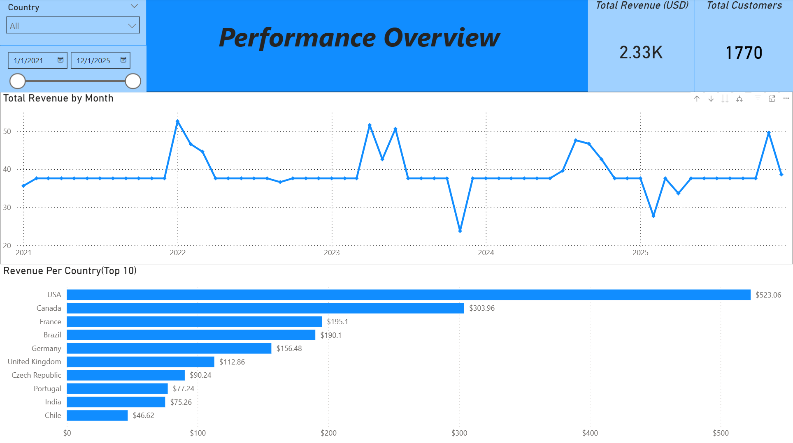

# Music Store Analytics (SQL + Power BI)

This project analyzes a digital music store database using PostgreSQL and Power BI to evaluate revenue trends, customer value, product performance, and support operations.

The analysis connects sales outcomes to the business processes that drive them, including customer purchases, invoice line items, product catalog performance, geographic revenue concentration, and employee-supported customer revenue.

## Dashboard Preview



## Business Questions

- How does total revenue trend over time?
- Which countries generate the most revenue?
- Which customers contribute the most lifetime value?
- Which artists, tracks, and genres drive revenue performance?
- How does support employee performance compare by revenue and customer coverage?

## Business Process

Customer Purchase → Invoice → Invoice Line Item → Track / Album / Artist / Genre → Revenue Reporting → Customer & Product Performance Monitoring

## KPI Framework

| Business Area | Outcome KPI | Driver KPIs / Segments |
|---|---|---|
| Revenue Performance | Total Revenue | Month, Country, Customer Count |
| Customer Value | Lifetime Value | Customer, Country, Total Lifetime Revenue |
| Product Performance | Product Revenue | Artist, Track, Genre, Revenue Contribution % |
| Operations Performance | Support Revenue | Support Rep, Revenue per Employee, Revenue per Supported Customer |

## SQL & Modeling Workflow

- Used the Chinook relational database as the source model.
- Joined customer, invoice, invoice line, track, album, artist, genre, and employee tables.
- Created SQL logic to calculate revenue trends, customer lifetime value, product revenue, and employee-supported revenue.
- Built reporting views to centralize revenue, customer, product, and operations logic.
- Connected the modeled data to Power BI dashboards for executive and operational analysis.

## Key Findings

- Total revenue was approximately $2.33K across the reporting period.
- The United States generated the highest revenue among countries.
- A small group of customers contributed higher lifetime value than the broader customer base.
- Rock generated the largest share of genre revenue.
- Top artists and tracks accounted for a meaningful share of product revenue.
- Support employee revenue contribution was relatively balanced across representatives.

## Tools Used

- PostgreSQL
- SQL
- Power BI
- DAX
- SQL Views
- Joins
- Aggregations
- Window Functions
- Customer Lifetime Value Analysis
- Revenue Analysis
- Business Intelligence Reporting

## Repository Structure

```text
sql/
screenshots/
README.md
```

## Full Portfolio Walkthrough

A deeper project walkthrough is available in my Notion portfolio, including the business process, KPI framework, dashboard analysis, SQL implementation, revenue logic, and business insights.
